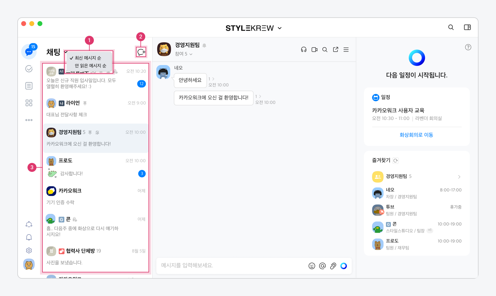

# 채팅 시작

**채팅** 탭에서는 채팅방을 생성하고, 생성된 채팅방 리스트를 확인할 수 있습니다. 카카오워크에서는 채팅방에 대한 다양한 관리 및 설정 기능을 제공합니다. 또한 채팅방 안에서 음성채팅, 메시지 검색, 멘션, 공지, 이모지 반응 등 유용한 기능들을 활용해 멤버들과 대화를 나눌 수 있습니다.

***

**채팅 탭 구성**



<figure><figcaption>
카카오워크 PC
</figcaption></figure>

| 구분         | 설명                                                                                                                                           |
| ---------- | -------------------------------------------------------------------------------------------------------------------------------------------- |
| ⓵ 채팅방 정렬   | 최신 메시지 순, 안 읽은 메시지 순으로 채팅방 정렬                                                                                                                |
| ⓶ 채팅방 생성   | 
멤버, 조직명을 검색하거나 조직도를 통해 1:1 채팅방 또는 그룹 채팅방을 생성 - 관리자가 비밀 채팅방 사용 On 으로 설정한 경우, 일반 채팅방/비밀 채팅방 생성 옵션 제공
                                 |
| ⓷ 채팅방 리스트  | 
참여 중인 모든 채팅방 표시 - Bot과의 채팅방, 나와의 채팅방, 그룹 채팅방, 비밀 채팅방 등
                                                                             |
|   전체 채팅방   | 
[All] 아이콘이 붙은 채팅방으로, 모든 워크스페이스 멤버들이 자동으로 참여하는 채팅방
<ul><li>조직도와 연동되어 멤버 자동 참여 및 탈퇴 처리</li><li>모든 워크스페이스에 기본으로 생성되며 임의로 퇴장 불가능</li></ul> |
|    나와의 채팅방 | 
[나] 아이콘이 붙은 채팅방으로, 나만 참여 및 조회할 수 있는 채팅방
<ul><li>임의로 퇴장 불가능</li></ul>                                                                   |
|   그룹 채팅방   | 팀 별, 프로젝트 별 목적에 따라 생성하여 세 명 이상의 멤버로 구성된 채팅방                                                                                                  |
|    1:1 채팅방 | 두 명의 멤버로 구성된 채팅방으로, 다른 멤버와 1:1로 대화하는 채팅방                                                                                                     |
|    봇과의 채팅방 | 카카오워크 필수 기능 안내, 기기 인증 등 중요한 자동 알림 메시지를 수신하는 채팅방                                                                                              |
|    그룹사 채팅방 | 파란색 채팅 아이콘이 붙은 채팅방으로, 그룹사 멤버가 참여한 채팅방                                                                                                        |
|    외부 채팅방  | 빨간색 채팅 아이콘이 붙은 채팅방으로, 외부 워크스페이스 멤버가 참여한 채팅방                                                                                                  |
|   비밀 채팅방   | 자물쇠 아이콘이 붙은 채팅방으로, 메시지가 자동으로 삭제되는 채팅방                                                                                                        |



<figure><figcaption>
카카오워크 Mobile
</figcaption></figure>



## 채팅 시작

채팅방을 생성해 멤버들과 대화를 시작할 수 있습니다. 채팅방을 생성하는 방법은 다음과 같습니다.

### 채팅 탭에서 **채팅방 생성하기**

**채팅** 탭에서 대화 상대를 직접 선택하거나 조직도를 통해 채팅방을 생성할 수 있습니다.

1.  [채팅방] 아이콘을 클릭하여 대화할 상대를 멤버 또는 조직명으로 검색해 선택하고, [선택] 버튼을 클릭합니다.

    * 멤버 **초대** 팝업창에서는 즐겨찾기로 등록된 멤버가 기본값으로 나타나며, 검색을 통해 다른 멤버를 추가할 수 있습니다.
    * **조직도에서 초대**를 클릭하면 조직도에서 멤버를 조회해 대화 상대로 추가할 수 있습니다.

    
2.  채팅방이 생성되면 메시지를 입력하고 엔터를 누르거나 [전송] 아이콘을 클릭해 채팅을 시작합니다.

    * 채팅방이 생성된 후, 메시지를 전송해야만 대화 상대방에게도 채팅방이 노출됩니다.
    * 채팅 시작 전 그룹 채팅방명을 설정하면 모두에게 같은 이름으로 채팅방이 개설됩니다.

    

### 조직도에서 그룹 **채팅방 생성하기**

조직도의 가장 하위 계층에 속하는 조직에서 그룹 채팅방을 바로 생성할 수 있습니다. 조직도에서 채팅방을 생성 시, 해당 조직에 속한 멤버가 자동으로 선택되어 빠르게 대화방을 생성할 수 있습니다.

1.  [조직도] 아이콘을 클릭합니다.

    
2.  채팅방을 생성할 조직을 선택하고, 참여 그룹 및 멤버를 확인 후 [채팅방] 버튼을 클릭합니다.

    
3.  해당 조직의 멤버가 모두 포함된 채팅방이 생성됩니다.

    * 채팅방이 생성된 후, 메시지를 전송해야만 대화 상대방에게도 채팅방이 노출됩니다.
    * 채팅 시작 전 그룹 채팅방명을 설정하면 모두에게 같은 이름으로 채팅방이 개설됩니다.

    

### 프로필에서 채팅방 생성하기

멤버 프로필에서 해당 멤버와 채팅을 시작할 수 있습니다.

1.  **다이내믹 패널 > 즐겨찾기** 혹은 조직도에서 멤버의 프로필 이미지를 클릭해, 프로필 상세 화면에서 [말풍선] 아이콘을 클릭합니다.

    * **즐겨찾기**의 멤버 프로필을 클릭하면 해당 멤버와의 1:1 채팅방으로 바로 이동할 수 있습니다.

    
2.  채팅방이 생성되면 메시지를 입력하고 엔터를 누르거나 [전송] 아이콘을 클릭해 채팅을 시작합니다.

    * 채팅방이 생성된 후, 메시지를 전송해야만 대화 상대방에게도 채팅방이 노출됩니다.

    

### 특정 멤버와 함께 있는 채팅방 확인하기

멤버의 프로필 창에서 [함께 있는 채팅방] 아이콘을 클릭하면, 해당 멤버와 함께 있는 그룹 채팅방 목록을 확인할 수 있습니다.

* **이 멤버와 새로운 채팅방 만들기**를 클릭하면, 해당 멤버를 포함한 채팅방을 편리하게 생성할 수 있습니다.

### 외부 멤버와 대화하기

업무 목적으로 외부 워크스페이스에 속한 멤버와 대화가 필요한 경우, 나 또는 상대방을 외부 멤버로 추가하여 상대방과 대화를 할 수 있습니다. 외부 멤버와 대화를 시작하기 전 [내 프로필을 공유](https://www.notion.so/3-eba0cbf72ae3488ca48db9cfff7a6cbd)하여 상대방이 나를 외부 멤버로 등록하거나, [상대방의 프로필을 공유받아](https://www.notion.so/3-eba0cbf72ae3488ca48db9cfff7a6cbd) 상대방이 나를 외부 멤버로 등록해야 합니다.


**안내**\
해당 기능은 워크스페이스 관리자가 외부 멤버와 대화 기능을 허용했을 경우에만 사용할 수 있습니다. 해당 기능이 필요한 경우에는 조직의 워크스페이스 관리자에게 활성화를 요청하시기 바랍니다.


1.  **채팅** 탭에서 [채팅방] 아이콘 > **조직도에서 초대**를 클릭합니다.

    
2.  **조직도에서 멤버 선택** 팝업창의 **외부 멤버** 메뉴에서 대화할 상대를 선택하고, [선택] 버튼을 클릭합니다.

    
3.  안내 팝업창에서 [채팅방 개설] 버튼을 클릭합니다.

    
4.  채팅방이 생성되면 메시지를 입력하고 엔터를 누르거나 [전송] 아이콘을 클릭해 채팅을 시작합니다.

    * 채팅방이 생성된 후, 메시지를 전송해야만 대화 상대방에게도 채팅방이 노출됩니다.

    

### 비밀 채팅방 만들기

방장이 설정한 시간에 따라 메시지가 자동으로 삭제되는 채팅방을 만들 수 있습니다. 해당 기능은 워크스페이스 관리자가 비밀 채팅방 사용을 활성화해야만 사용할 수 있습니다. (Standard 요금제 이상)

1. 채팅 탭에서 [채팅방] 아이콘을 선택하고, 비밀 채팅방 아이콘을 선택합니다.
2. 메시지 삭제 시간을 설정합니다.
3. 참여 멤버를 선택합니다.
   * 그룹사 멤버 초대는 가능하지만, 외부 멤버는 초대가 아직 불가능합니다.

## 채팅방 관리

카카오워크에서는 다양한 채팅방 관리 및 설정 기능을 제공하고 있습니다. 개인 맞춤 설정을 통해 더 편리하게 채팅을 이용할 수 있습니다.

### 채팅방 이미지 및 제목 수정하기

채팅방별로 채팅방의 프로필 이미지와 제목을 설정할 수 있습니다.

* 채팅방 프로필 이미지와 제목은 채팅방에 참여 중인 모든 멤버에게 동일하게 적용됩니다.

1.  채팅방에서 [더보기] 아이콘을 클릭한 후, 다이내믹 패널의 [채팅방 설정] 아이콘을 클릭합니다.

    
2.  다이내믹 패널의 **채팅방 설정**에서 [프로필 수정] 버튼을 클릭합니다.

    
3.  채팅방 프로필 이미지 혹은 채팅방 제목을 변경한 후, [저장] 버튼을 클릭합니다.

    

### 채팅방 알림음 설정하기

채팅방별로 메시지 알림음을 다르게 설정할 수 있습니다.

1.  채팅방에서 [더보기] 아이콘을 클릭한 후, 다이내믹 패널의 [채팅방 설정] 아이콘을 클릭합니다.

    
2.  다이내믹 패널의 **채팅방 설정**에서 현재 채팅방 알림음을 설정합니다.

    

### 배경화면 설정하기

사용자의 선호에 따라 채팅방의 배경 색상을 변경할 수 있습니다.

> **개별 채팅방 배경화면**

1.  채팅방에서 [더보기] 아이콘을 클릭한 후, 다이내믹 패널의 [채팅방 설정] 아이콘을 클릭합니다.

    
2.  다이내믹 패널의 **채팅방 설정**에서 원하는 배경화면 색상을 선택합니다.

    

**모든 채팅방 배경화면**

모든 채팅방의 배경화면을 한 번에 변경할 수 있습니다.

1. **[설정] 아이콘 > 채팅** 메뉴로 이동합니다.
2.  원하는 배경화면 색상을 선택하고, **모든 채팅방에 적용**을 클릭합니다.

    

### 입력창 잠금하기

그룹 채팅방 등 대화에 주의가 필요한 채팅방에 입력창 잠금 기능을 설정할 수 있습니다. 입력창 잠금을 설정하면 해당 채팅방에 입장할 때마다 메시지 입력이 제한됩니다.

1.  채팅방에서 [더보기] 아이콘을 클릭한 후, 다이내믹 패널의 [채팅방 설정] 아이콘을 클릭합니다.

    
2.  다이내믹 패널의 **채팅방 설정**에서 채팅방 **입력창 잠금**을 활성화합니다.

    
3.  채팅방 입력창 잠금이 설정된 채팅방에는 입력 제한 메시지가 표시됩니다.

    * [잠금해제] 아이콘을 클릭하면 잠금이 해제되어 메시지를 입력할 수 있습니다.

    

### 방장 설정 기능

일부 채팅방 설정은 채팅방을 생성한 방장만 수행할 수 있습니다. **채팅방 설정** 메뉴 내 **방장 설정 기능** 탭은 방장에게만 노출되며 채팅방 초대 허용, 멤버 내보내기, 방장 위임 기능을 활용할 수 있습니다.

* 방장의 경우, **채팅방 설정** 메뉴에 **채팅방 나가기**가 표시되지 않습니다. 채팅방을 나가려면 방장을 다른 멤버에게 위임해야 합니다.

**채팅방 초대 허용하기**

채팅방 초대 허용을 활성화하면 채팅방 참여자 누구나 채팅방에 새로운 멤버를 초대할 수 있습니다.

* **채팅방 초대 허용**을 비활성화한 경우에는 방장만 채팅방 초대 권한을 갖습니다.

1.  채팅방에서 [더보기] 아이콘을 클릭한 후, 다이내믹 패널의 [채팅방 설정] 아이콘을 클릭합니다.

    
2.  다이내믹 패널의 **채팅방 설정**에서 **방장 설정 기능** > **채팅방 초대 허용**을 활성화합니다.

    

**멤버 내보내기**

채팅방 내 특정 멤버를 내보낼 수 있습니다. 내보내기가 완료되면 내보낸 멤버에게 채팅방 퇴장 메시지가 전송됩니다.

1.  채팅방에서 [더보기] 아이콘을 클릭한 후, 다이내믹 패널의 [채팅방 설정] 아이콘을 클릭합니다.

    
2.  다이내믹 패널의 **채팅방 설정**에서 **방장 설정 기능** > **멤버 내보내기**를 클릭합니다.

    
3. 내보낼 멤버를 선택하고 [확인] 버튼을 클릭합니다.

**방장 위임하기**

채팅방 내 특정 멤버에게 방장을 위임할 수 있습니다.

* 방장은 채팅방을 나갈 수 없으며, 채팅방을 나가려면 방장을 다른 멤버에게 위임해야 합니다.

1.  채팅방에서 [더보기] 아이콘을 클릭한 후, 다이내믹 패널의 [채팅방 설정] 아이콘을 클릭합니다.

    
2.  다이내믹 패널의 **채팅방 설정**에서 **방장 설정 기능** > **방장 위임하기**를 클릭합니다.

    
3.  위임할 멤버를 선택하고 [확인] 버튼을 클릭합니다.

    

### 채팅방 정렬하기

채팅방 정렬 방식을 **최신 메시지 순** 또는 **안 읽은 메시지 순**으로 선택할 수 있습니다. **채팅** 탭의 **채팅**을 클릭하여, 채팅 정렬 방식을 선택합니다.

### 채팅방 고정하기

**채팅** 탭에서는 여러 개의 채팅방을 최상단에 고정(최대 10개) 할 수 있는 기능을 지원합니다. 중요하거나 자주 대화하는 채팅방을 고정하여 빠르고 편리하게 대화를 시작할 수 있습니다. 고정하려는 채팅방을 마우스 우클릭하고 **채팅방 상단 고정** 버튼을 클릭해 채팅방을 고정합니다.

* 채팅방 고정을 해제하고 싶은 경우에는, **채팅방 상단 고정** 버튼을 다시 클릭합니다.

## 채팅 기본 기능

채팅방을 생성했다면, 메시지를 전송해 채팅을 시작합니다. 멤버들과 메시지를 주고받을 때 채팅방의 답장, 멘션, 공지 등 업무에 특화된 다양한 기능을 활용할 수 있습니다.

**채팅방 구성**

### 음성채팅

음성채팅은 채팅방 멤버들과 음성으로 대화할 수 있는 서비스입니다. 음성채팅 기능을 통해 멤버들과 빠르게 연결되어 채팅방 내에서 간편하게 소통할 수 있습니다.

음성채팅은 채팅방 멤버라면 누구나 시작할 수 있으며 자유롭게 참여할 수 있습니다. 참여자가 모두 나가면 음성채팅이 종료됩니다.

**음성채팅 시작**

채팅방의 [음성채팅] 아이콘을 클릭하여, 해당 채팅방에서 음성채팅을 시작합니다.

* 음성채팅 시작 메시지가 채팅방에 자동 발송됩니다.


**안내**

Mac PC에서는 스피커 설정이 시스템 기본 스피커로 지정되며, 변경이 불가합니다.


**음성 채팅 참여**

채팅방에서 진행 중인 음성채팅에 참여할 수 있습니다. 음성채팅이 진행 중인 채팅방은 채팅방 제목에 초록색 [음성채팅] 아이콘이 표시됩니다.

음성 채팅에 참여하려면, 채팅방에 입장한 후 [음성채팅] 아이콘을 클릭합니다.

* [음성채팅] 아이콘에 마우스 커서를 올려 현재 음성채팅에 참여 중인 멤버의 프로필 사진을 확인할 수 있습니다.

.png)


**안내** 특정 상황에서는 음성채팅 참여가 제한됩니다.

* 음성채팅의 최대 참여 인원 수는 200명으로, 이미 200명이 참여하고 있다면 새로운 멤버는 음성채팅에 참여할 수 없습니다.
* 음성채팅은 기기당 1개의 채팅방에서만 참여할 수 있습니다. 하나의 계정이 여러 개의 디바이스를 사용 중인 경우 각각의 디바이스에서 다른 음성채팅에 참여할 수 있습니다.


### 답장하기

답장하기는 채팅방 내 특정 메시지에 대해 답장을 보낼 수 있는 기능입니다.

1.  메시지에 마우스 커서를 위치하고 [↳] 아이콘을 클릭하거나, 메시지에 마우스 우클릭하고 **답장**을 클릭합니다.

    
2.  메시지를 입력하고 엔터를 누르거나 [전송] 아이콘을 클릭합니다.

    

### 멘션하기

멘션하기는 채팅방 안에서 특정 대화 상대를 언급하는 기능입니다. 해당 멤버에게는 멘션 부분이 강조 표시된 메시지가 전달됩니다.

1.  채팅방 입력창에 `@`를 입력 혹은 [@] 아이콘을 클릭하고, 멘션할 멤버를 선택하거나 입력합니다.

    * 채팅방 내 전체 멤버를 멘션할 경우 `@all`을 입력합니다.

    
2.  메시지를 입력하고 엔터를 누르거나 [전송] 버튼을 클릭합니다.

    

### 삭제하기

내가 채팅방에 전송한 메시지는 전송 후 5분 이내 삭제가 가능합니다. 이때 상대방의 메시지 확인 여부에 상관없이 메시지를 삭제할 수 있습니다.

1.  삭제하고 싶은 메시지에 마우스 우클릭하고 **삭제**를 클릭합니다.

    
2. **메시지 삭제** 팝업창에서 [삭제] 버튼을 클릭합니다.


**주의**\
\*\*\*\*삭제된 메시지는 복구할 수 없습니다.


### 전달하기

채팅방의 특정 메시지를 다른 채팅방으로 전달할 수 있습니다.

1.  전달하려는 메시지에 마우스 우클릭하고 **전달**을 클릭합니다.

    
2.  메시지를 전달할 멤버 혹은 채팅방을 선택하고 [확인] 버튼을 클릭합니다.

    
3.  해당 채팅방으로 메시지가 전달됩니다.

    

### 번역하기

채팅방 대화 중 번역 기능을 사용할 수 있습니다. 번역은 OS에 설정된 언어를 기준으로 하며, 현재 한국어 기준으로 중국어, 영어, 일본어 등 총 19개 언어의 번역을 지원합니다.

*   **지원하는 언어 (2022년 4월 기준)**

    한국어 기준 중국어, 영어, 일본어, 인도네시아어, 베트남어, 포르투갈어, 아랍어, 러시아어, 태국어, 이탈리아어, 벵골어, 말레이시아어, 힌디어, 네덜란드어, 독일어, 터키어, 프랑스어, 스페인어 등 총 19개 언어의 번역을 지원합니다.

1.  번역이 필요한 메시지에 마우스 우클릭 후, **번역**을 클릭합니다.

    
2.  OS에 설정된 언어를 기준으로 메시지가 번역됩니다.

    

### 공지하기

중요한 메시지는 공지로 등록하여 채팅방 상단에 고정할 수 있습니다. 채팅방 상단 공지에는 가장 최신에 등록된 공지 한 건만 표시됩니다.

1.  공지할 메시지를 마우스 우클릭 후 **공지로 등록**을 클릭합니다.

    
2.  [확인] 버튼을 클릭하면 채팅방 상단에 공지가 등록되고, 공지 알림 메시지가 자동으로 전송됩니다.

    

**공지 모아보기**

**공지 모아보기** 기능을 통해 내가 참여하고 있는 채팅방에 등록된 공지를 한 눈에 확인할 수 있습니다.

1.  채팅방에서 [더보기] 아이콘을 클릭한 후, 다이내믹 패널에서 **공지**의 **전체보기**를 클릭합니다.

    
2.  **공지**에서 해당 채팅방에 등록되었던 공지들을 확인할 수 있습니다.

    * 자신이 등록한 공지는 [삭제] 아이콘을 클릭하여 삭제할 수 있습니다.

    

### 안 읽은 멤버 확인하기

채팅방에서 특정 메시지를 읽은 멤버와 안 읽은 멤버를 확인할 수 있습니다. 멤버가 1,000명 이상인 채팅방에는 제공되지 않으며, 사용자 본인과 AI 어시스턴트 캐스퍼는 멤버 목록에서 제외됩니다. Webhook Bot은 채팅방에서 실행되기 전까지 항상 **안 읽음**으로 표시됩니다.

메시지 옆에 표시되는 숫자를 클릭하면 해당 메시지를 읽은 멤버와 안 읽은 멤버를 확인할 수 있습니다.

### 이모지로 반응하기

이모지 반응은 이모지(Emoji)를 사용하여 특정 메시지에 쉽고 빠르게 응답할 수 있는 기능입니다. 총 6가지 이모지(👍, 👌, 😍, 😮, 😢, 😤)로 감정을 표현합니다.

이모지로 반응할 메시지 위에 마우스 커서를 올린 후 원하는 이모지를 클릭합니다.

* 한 개의 메시지에 여러 개의 이모지로 반응할 수 있으며, 반응한 이모지를 다시 클릭하면 이모지 반응이 해제됩니다.

**이모지 반응 멤버 확인하기**

1.  메시지에 마우스 우클릭하고, **이모지 반응한 멤버**를 클릭합니다.

    .png)
2.  각 탭에서 이모지별 반응 멤버를 확인할 수 있으며, 이모지로 반응한 순서대로 멤버들이 정렬됩니다.

    

### 카카오톡 이모티콘 사용하기

카카오 계정을 카카오워크에 연동하면 카카오톡에서 구입한 이모티콘을 카카오워크에서도 사용할 수 있습니다.

1.  채팅방에서 [이모티콘] 아이콘을 클릭하고, **자물쇠** 탭에서 [카카오 로그인] 버튼을 클릭합니다.

    
2.  카카오계정으로 로그인하고 [동의하고 계속하기] 버튼을 클릭합니다.

    
3.  채팅방의 이모티콘 목록에서 카카오톡에서 사용 중인 이모티콘을 확인합니다.

    * [설정] 아이콘을 클릭하여 이모티콘을 삭제하거나 배열 순서를 변경할 수 있습니다.

    

### 이미지/파일 전송하기

카카오워크는 한 번에 최대 100개까지의 이미지와 파일 전송 기능을 지원합니다.

1.  [첨부] 아이콘을 클릭하고 이미지나 파일을 첨부합니다.

    * 드래그 앤 드롭(Drag\&drop), 복사 후 붙여넣기 등의 방식으로도 첨부가 가능합니다.
    * 여러 개의 사진을 한번에 보내는 경우, 최대 30개 단위로 묶음 전송됩니다.

    
2.  채팅방에서 [더보기] 아이콘을 클릭하면 채팅방에 공유된 이미지와 파일을 확인할 수 있습니다.

    
3. 각 탭에서 **전체보기**를 클릭하면 채팅방에 공유된 이미지와 파일을 한번에 모아볼 수 있습니다.
   *   **사진, 동영상 탭 > 전체보기**에서 [내려받기/전달하기] 아이콘 클릭 시, 원하는 이미지와 파일을 다운로드하거나 채팅방에 전달할 수 있습니다.

       
   *   **파일 탭 > 전체보기**에서 각 파일의 [더보기] 아이콘을 클릭해 파일 저장 / 전달 / 대화보기 기능을 사용할 수 있습니다.

       

**저장 파일 확인**

채팅방에서 저장한 파일은 기본적으로 아래의 경로에 저장됩니다.

[표. 저장 위치](https://www.notion.so/387cf8b7aaf94b39a7dad7074a2a962a)

**파일 다운로드 위치 변경**

다운로드 받은 파일이나 이미지의 저장 위치를 변경할 수 있습니다.

1.  [설정] 아이콘을 클릭합니다.

    
2.  **채팅 메뉴 >** **다운로드 폴더**의 [변경] 버튼을 클릭해 원하는 저장 위치를 선택합니다.

    
